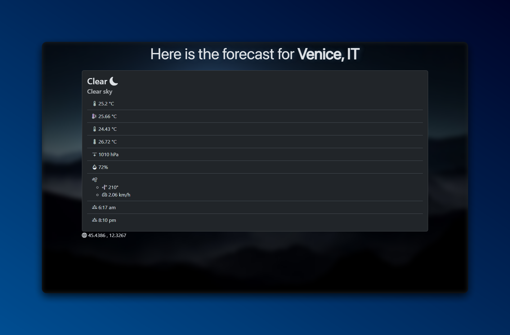

# ☀️ Weather Website



[](https://nodejs.org/)
[](https://expressjs.com/)
[](https://github.com/EXELVI/Weather_website/commits/main)

A weather forecasting website built using Node.js, Express, and the OpenWeatherMap API. The website allows users to search for the current weather in any city and provides a motivational quote of the day.

## 🌟 Features

- **Current Weather Information**: Get up-to-date weather information for any city.
- **Dynamic Weather Icons**: Display weather icons and images based on the current weather conditions.
- **Motivational Quote**: Get a daily motivational quote each time you visit the site.

## 🛠️ Installation

1. **Clone the repository**:
    ```bash
    git clone https://github.com/EXELVI/Weather_website.git
    cd Weather_website
    ```

2. **Install dependencies**:
    ```bash
    npm install
    ```

3. **Set up environment variables**:
    Create a `.env` file in the root directory and add the following:
    ```env
    apiKey=YOUR_OPENWEATHERMAP_API_KEY
    theySaidSoApi=YOUR_THEYSAIDSO_API_KEY
    portHttp=80
    portHttps=443
    ```

4. **Run the application**:
    ```bash
    npm start
    ```
    The server will run on `http://localhost:80` and `https://localhost:443`.

## 📝 Usage

- Navigate to the homepage and search for a city to get the current weather information. 
- The website will display the city name, temperature, weather description, and a lot more.
- A motivational quote will be displayed on the homepage each time you visit the site.


## 🌍 API References

- [OpenWeatherMap API](https://openweathermap.org/api)
- [They Said So Quotes API](https://quotes.rest/)

## 🤝 Contributing

Contributions, issues, and feature requests are welcome! Feel free to check the [issues page](https://github.com/EXELVI/Weather_website/issues).
